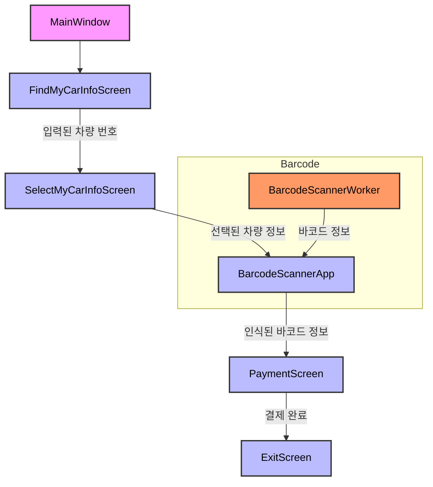

# ROKEY_high
DOOSAN ROKEY 심화반 스타벅스 프로젝트

```mermaid
graph TD;
    style A fill:#f9f,stroke:#333,stroke-width:2px,color:#000;
    style B fill:#bbf,stroke:#333,stroke-width:2px,color:#000;
    style C fill:#bbf,stroke:#333,stroke-width:2px,color:#000;
    style D fill:#bbf,stroke:#333,stroke-width:2px,color:#000;
    style E fill:#bbf,stroke:#333,stroke-width:2px,color:#000;
    style F fill:#bbf,stroke:#333,stroke-width:2px,color:#000;
    style H fill:#f96,stroke:#333,stroke-width:2px,color:#000;

    A[MainWindow] --> B[FindMyCarInfoScreen]
    B -->|입력된 차량 번호| C[SelectMyCarInfoScreen]
    C -->|선택된 차량 정보| D[BarcodeScannerApp]
    D -->|인식된 바코드 정보| E[PaymentScreen]
    E -->|결제 완료| F[ExitScreen]
    
    subgraph Barcode
        H[BarcodeScannerWorker] -->|바코드 정보| D
    end
```